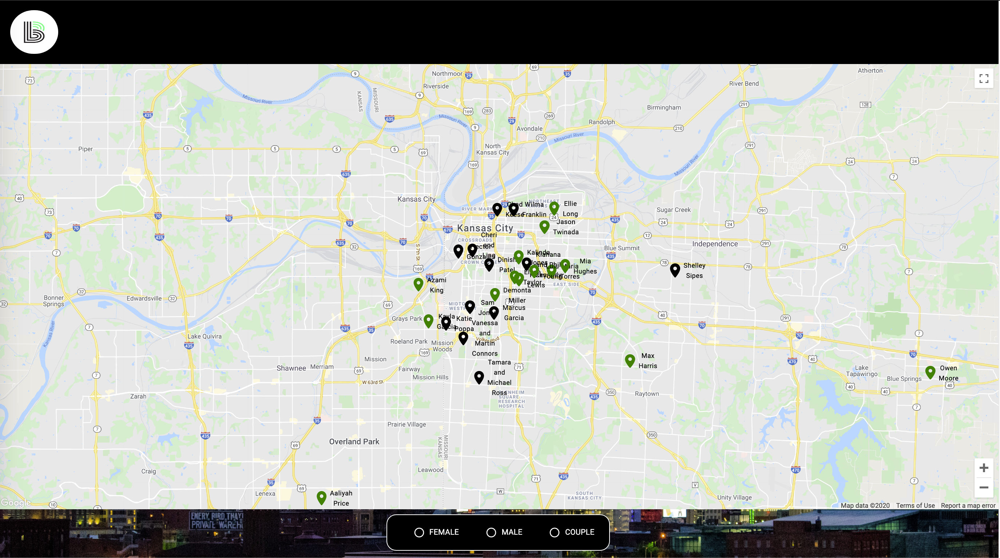
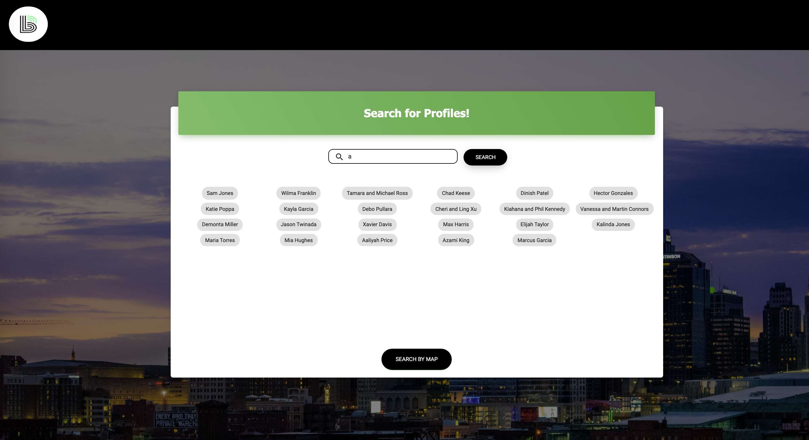
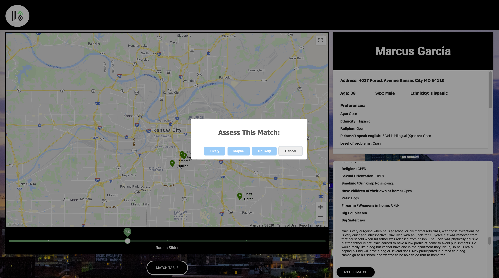
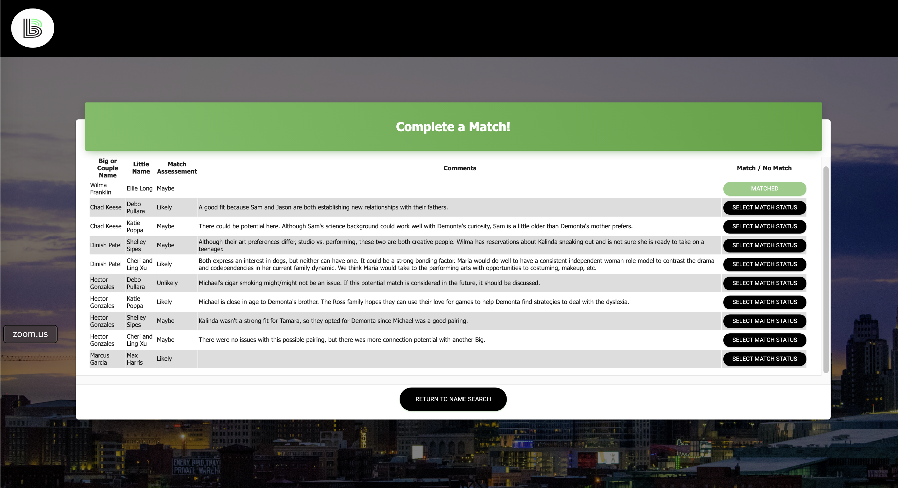

# Bridge-iT - A Big/Little matching tool for Big Brothers Big Sisters of Kansas City

## Description

**Duration:** 3 week sprint

**Team:** Caleb Wistuba, Andrew Nguyen, McKenna Lusk, Cole Chelton, Nicole 'Colby' Blechynden

Big Brothers Big Sisters plays an important role in pairing Bigs and Littles. Currently, the process of probing through a lot of summaries, home locations, individual requirements, and using that info to match a Big and Little, has proved to be complex. Bridge-iT is an application that will help to simplify this complex process allowing the staff to concentrate more on the human aspect of making these connections.

Bridge-iT generates a pinned location on a map once the Big or Little information has been loaded. You can reduce the number of pins by selecting preferences or radius. Once the pins have been narrowed, you can select on the toggle button to have a side by side view of the Big and Little profiles. This allows you to easily compare the two profiles and see if the two would be a good match.

To see the fully functional site, please visit: DEPLOYED VERSION OF THE APP 

## Screen Shots

The mentor/mentee profile PDFs are uploaded through a drag and drop action which includes a review opportunity before submitting


All active profiles appear on a map that can be filtered and/or scaled, the clickable pins change the page focus to the List page where comparisons can be viewed


Alternatively, a search by name also changes to the List page


The scaleable map shows proximity of a mentor to the mentees; displayed on the right are demographic, match preferences, and a summary display for the mentor and all available mentees within the given radius


Match Support Specialist assess the potential match likelihood for the mentor displayed


If an assessment has been made, the mentor/mentee pair appear on the Match Table, where final selections are made


## Prerequisites

Before you get started, make sure you have the following software installed on your computer:

- [Node.js](https://nodejs.org/en/)
- [PostrgeSQL](https://www.postgresql.org/)
- [Nodemon](https://nodemon.io/)

## Installation

- Run `npm install` in your terminal
- Create a `.env` file at the root of the project and paste this line into the file:
  ```
  SERVER_SESSION_SECRET=superDuperSecret
  ```
  While you're in your new `.env` file, take the time to replace `superDuperSecret` with some long random string like `25POUbVtx6RKVNWszd9ERB9Bb6` to keep your application secure. Here's a site that can help you: [https://passwordsgenerator.net/](https://passwordsgenerator.net/). If you don't do this step, create a secret with less than eight characters, or leave it as `superDuperSecret`, you will get a warning.
- Start postgres if not running already by using `brew services start postgresql`

- Run `npm run server`

- Run `npm run client`
- Navigate to `localhost:3000`

## Create database and table

Create a new database called `bbbs_matches` and create a `user` table:

```SQL
CREATE TABLE "user" (
    "id" SERIAL PRIMARY KEY,
    "username" VARCHAR (80) UNIQUE NOT NULL,
    "password" VARCHAR (1000) NOT NULL
);
```

If you would like to name your database something else, you will need to change `bbbs_matches` to the name of your new database name in `server/modules/pool.js`

Copy and paste the content of the init.sql file into your database SQL query tool to build the required tables. OPTIONAL: The data.sql file contains sample data for testing, training, demo, or development purposes

## Usage

### Administrator-

When the administrator is logged in, they will be able to view the user credential
Clicking the “Reset User” button begins the process of resetting the shared Big Brothers Big Sisters account credentials.

**The Reset Process:**

1. Click the “Reset User” button
1. Enter a new username and password for the shared Big Brothers Big Sisters account
1. Click “Save” to finish changing the shared account credentials

### Staff -

## Built With These Technologies

a full list of dependencies can be found in `package.json`

- Axios
- CSS
- Docker
- Express
- Google Maps API
- Heroku
- JavaScript
- HTML
- Material- UI
- Moment
- Node
- PDF- Parse
- PostgreSQL
- React
- Redux
- Redux-Saga
- SweetAlert
- TypeScript

## Deployment

### API Keys

For deployment, you will need to register and an API key for:

- [Google Maps](https://developers.google.com/maps/gmp-get-started)

1. Create a new Heroku project
1. Link the Heroku project to the project GitHub Repo
1. Create an Heroku Postgres database
1. Connect to the Heroku Postgres database from Postico
1. Create the necessary tables
1. Add an environment variable for `SERVER_SESSION_SECRET` with a nice random string for security
1. Add an environment variable for `REACT_APP_API_GMAP` with your Google Maps API key
1. In the deploy section, select manual deploy

## License

[MIT](./LICENSE.txt)

## Acknowledgement

Thanks to [Prime Digital Academy](https://www.primeacademy.io/) and our cohort peers for guiding us though the fundamentals of full stack development, providing us with a solid foundation in modern technologies, and their continued support in our development as software engineers.

## Feedback, Suggestions, Support

Please reach out to us on LinkedIn if you have comments, ideas, or interest in contributing to this project

- [Caleb Wistuba](https://www.linkedin.com/in/calebwistuba)
- [Andrew Nguyen](https://www.linkedin.com/in/andrew-th-nguyen)
- [McKenna Lusk](https://www.linkedin.com/in/mckenna-lusk)
- [Cole Chelton](https://www.linkedin.com/in/cole-chelton)
- [Nicole Blechynden](https://www.linkedin.com/in/nicoleblechynden/)
